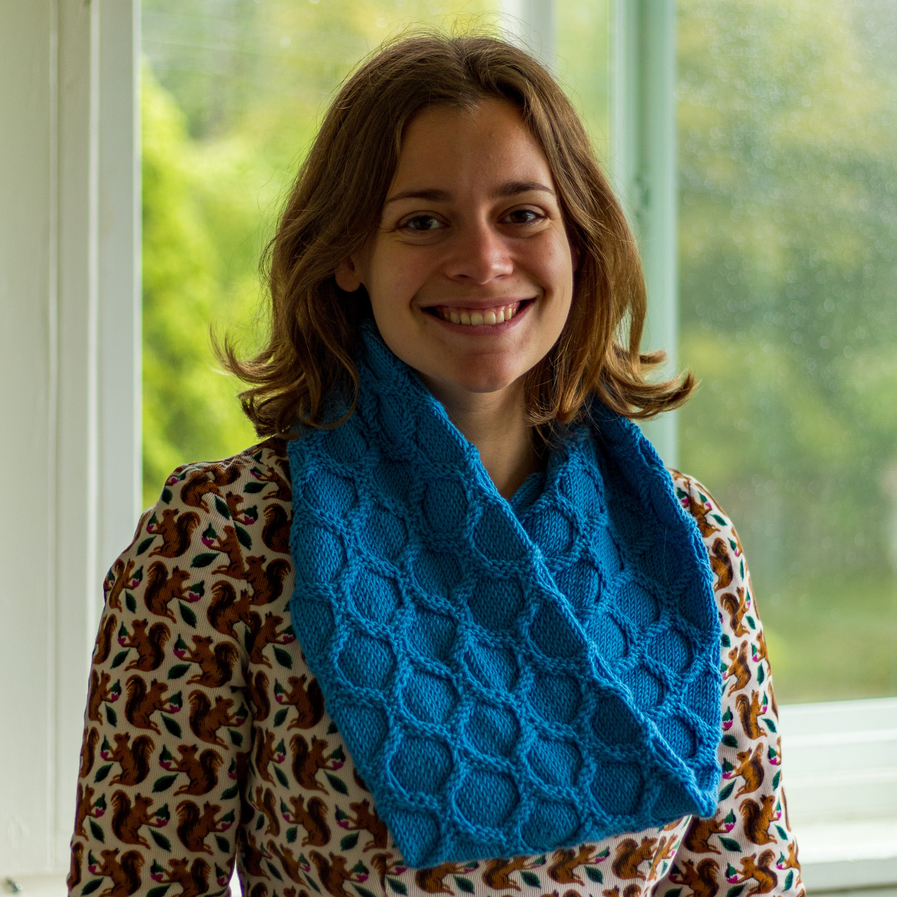

Title:Bio
Date: 2023-06-22

I am a fifth year PhD Student with Prof. Joel Moore in UC Berkely Physics Department. My PhD research has focused on novel physics in topological insulators and quantum phase transitions. I am currently finishing my dissertation, *Localization in quantum and classical disordered systems*.  Upon its completion, I am excited to apply techniques and ideas from my doctoral research to beginning a career in soft matter physics.

Current research interests include uncovering topological phases in classical systems, particularly models of knitted fabrics as well as developing symmetry-based methods to explain emergent elasticity in fabrics.

I am passionate about teaching and scientific outreach.  I have been a teaching assistant for 5 semesters and have taught outreach courses on wind power and the physics of music.  An exciting outreach project I'm currently working on is the design of science-inspired knitting patterns.

Outside of physics (and knitting!), I enjoy swimming, cooking, playing violin with friends, and hiking.

